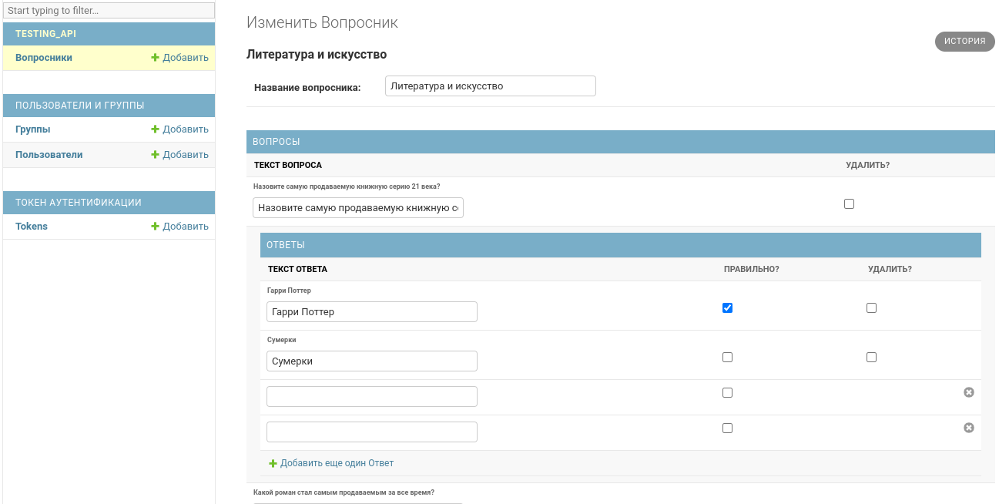
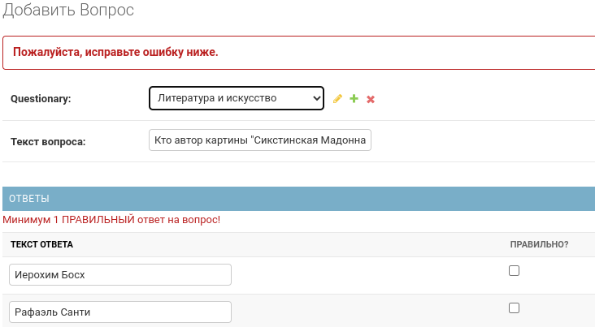
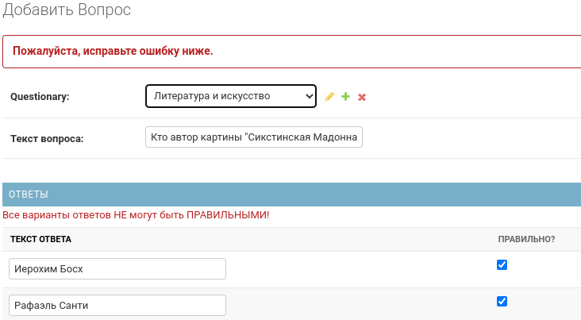
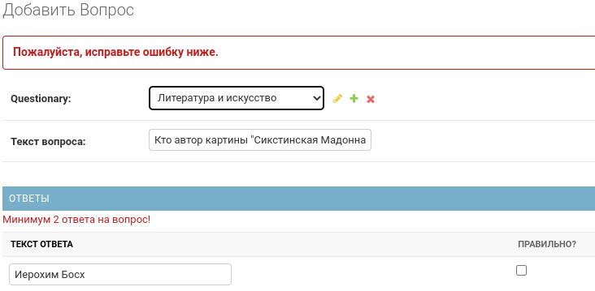

Нужно сделать простой сервис проведения тестирования по каким-либо темам. Т.е. есть тесты с вариантами ответов, один или несколько вариантов должны быть правильными. Тесты группируются в наборы тестов, которые затем пользователь может проходить и видеть свой результат.
<hr>

# Функциональные части сервиса:

+ Регистрация пользователей
+ Аутентификация пользователей
+ Зарегистрированные пользователи могут
+ Проходить любой из тестовых наборов
  + Последовательный ответ на все вопросы, каждый вопрос должен выводится на новой странице с отправкой формы (перескакивать через тесты или оставлять неотмеченными нельзя)
  + После завершения тестирования смотреть результат:
    + количество правильных/неправильных ответов
    + процент правильных ответов
+ Админка. Стандартная админка Django. Разделы:
    + Стандартный раздел пользователей
    + Раздел с наборами тестов
    + Возможность на странице набора тестов добавлять вопросы/ответы к вопросам/отмечать правильные ответы
    + Валидация на то, что должен быть хотя бы 1 правильный вариант
    + Валидация на то, что все варианты не могут быть правильными
    + Удаление вопросов/вариантов ответов/изменение правильных решений при редактировании тестового набора
<hr>

# Требования
+ Использовать Django Rest Framework (DRF)
+ В качестве СУБД использовать Postgresql
+ Для реализации аутентификации использовать JWT или TokenAuthentication
+ Покрыть код юнит-тестами используя *unittest* или *pytest*
+ Список всех зависимостей должен храниться в *requirements.txt*, соответственно можно установить их командой `pip install -r requirements.txt`.
+ Разработка должны вестись в *virtualenv*, но сама директория с *virtualenv* должна быть добавлена в *.gitignore*.
+ Настройки должны храниться в *settings.py*, но также, при наличии *settings_local.py* в той же директории, настройки из *settings_local.py* должны переопределять настройки в *settings.py*. Т.е. если есть файл *settings_local.py*, то определенные в нем параметры имеют больший приоритет. Сам файл *settings_local.py* добавляется в *.gitignore*. Таким образом у каждого девелопера и на бета сервере можно использовать кастомные настройки, например для соединения с БД.
+ Должен работать один из способов создания структуры БД. Встроенный *manage.py syncdb* или миграции через **South** (будет плюсом).
+ По фронтенду требований никаких не предъявляется. Интерфейс на твое усмотрение и он не будет оцениваться. Можно использовать любимый фреймворк или, например, воспользоваться **Twitter Bootstrap**.
+ Весь код запушить в репозиторий на **GitHub**.
<hr>

<h1 align="center">ПОРЯДОК ВЫПОЛНЕНИЯ</h1>

- [x] Регистрация
- [x] Аутентификация


**Данные**
- [ ] Доступ к тестовым наборам только авторизированным пользователем
- [ ] Последовательный ответ на все вопросы каждый вопрос должен выводится на новой странице с отправкой формы (перескакивать через тесты или оставлять неотмеченными нельзя)


**Админка. Данные.**
- [ ] [X] Возможность на странице набора тестов добавлять вопросы/ответы к вопросам/отмечать правильные ответы
- [ ] [X] Удаление вопросов/вариантов ответов/изменение правильных решений при редактировании тестового набора

>Добавлять/Удалять/Изменять ОТВЕТЫ можно со стоницы ВОПРОСОВ.

`Neiled-inlines не реализовано. Валидацию Neiled-inline не проходит.`




**Админка. Валидация.**
- [x] Валидация на то, что должен быть хотя бы 1 правильный вариант
- [x] Валидация на то, что все варианты не могут быть правильными
```python
#testing_api/admin.py       AnswerInlineFormSet() => clean()

if self.instance.__total_answer__ is not None and self.instance.__total_answer__ < 2:
    raise ValidationError('Минимум 2 ответа на вопрос!')
if self.instance.__valid_answer__ is not None and self.instance.__valid_answer__ < 1:
    raise ValidationError('Минимум 1 ПРАВИЛЬНЫЙ ответ на вопрос!')
if self.instance.__valid_answer__ is not None and self.instance.__valid_answer__ == self.instance.__total_answer__:
    raise ValidationError('Все варианты ответов НЕ могут быть ПРАВИЛЬНЫМИ!')
```





